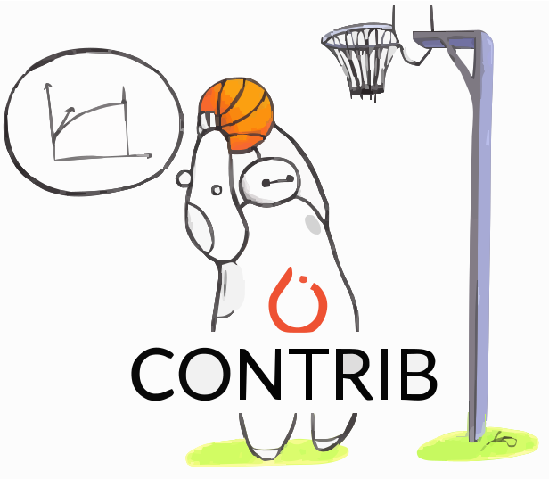
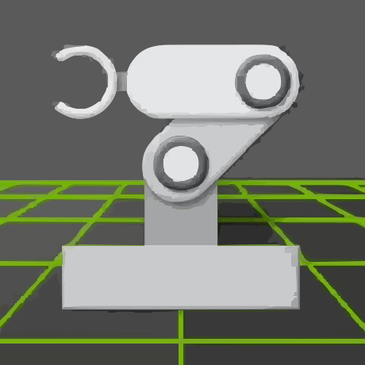
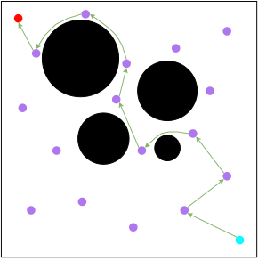
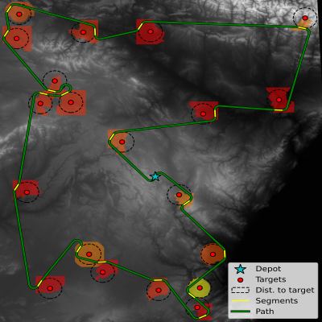
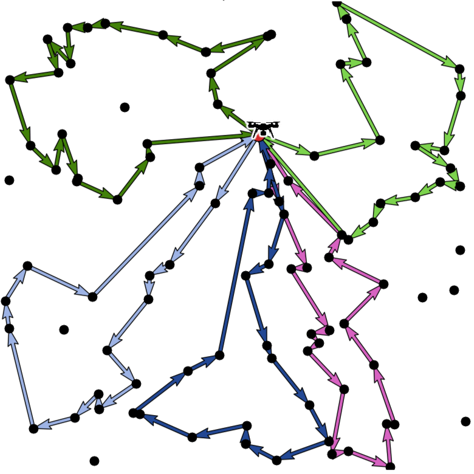
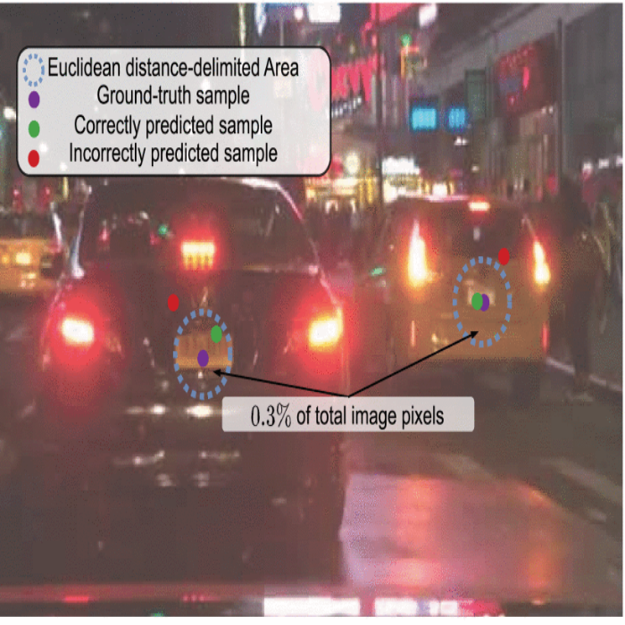
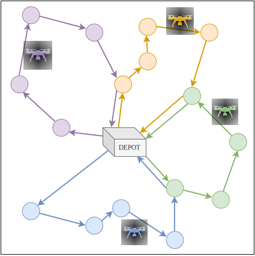
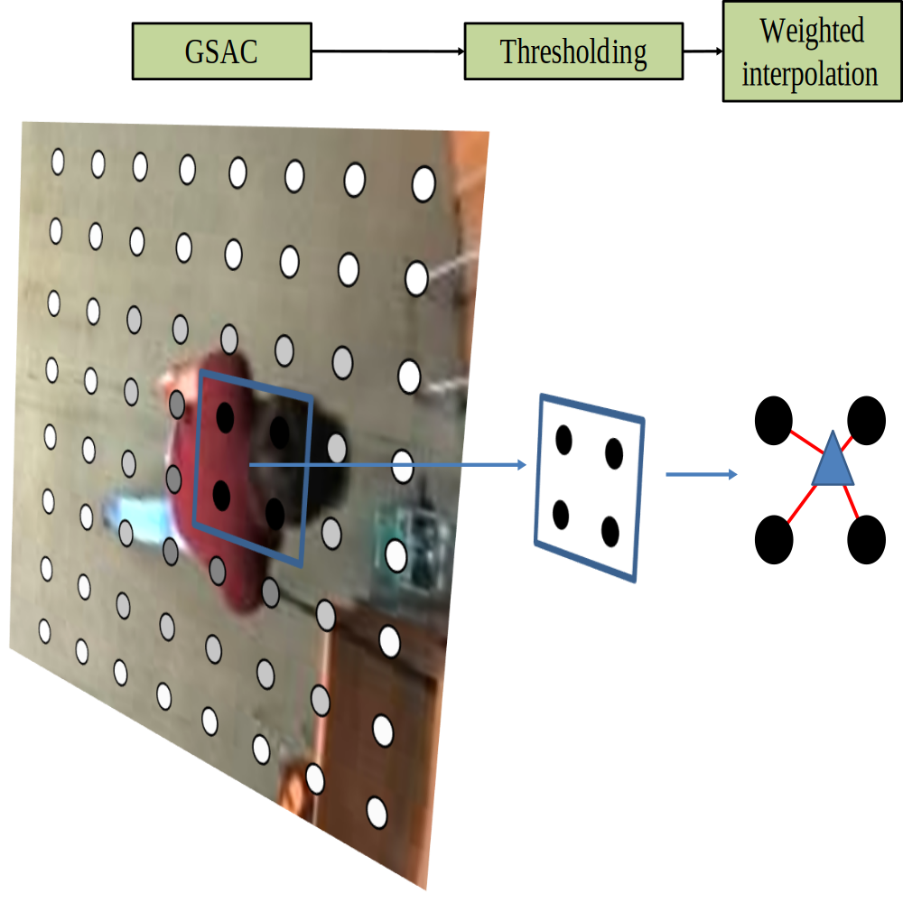
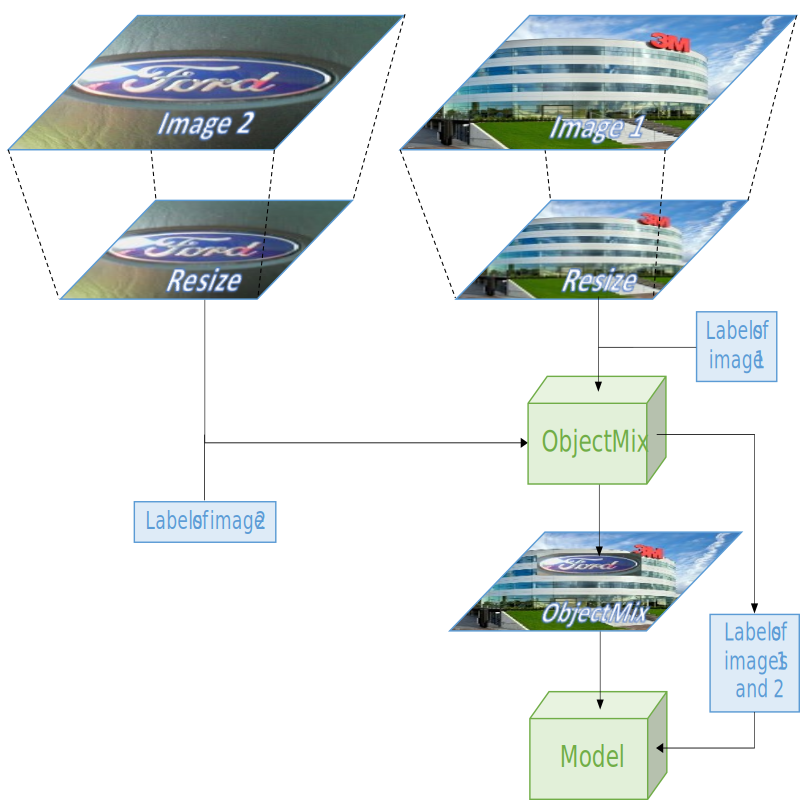
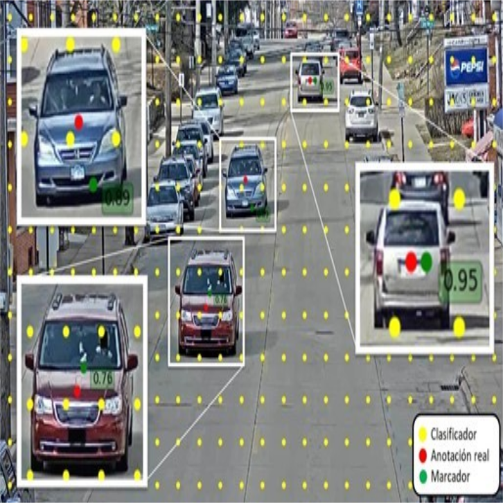

<!-- Presentation -->

  <!-- Image -->
  
  <!-- Text -->
  

    <h1 style="margin: 0; color: white;">
      Daniel Fuertes
    </h1>
    <h3 style="margin: 0; color: #eee;">
      PhD Student @ Universidad Politécnica de Madrid (UPM)
    </h3>
    

      🔬 AI Researcher &nbsp;|&nbsp;
      👨‍🏫 PhD Student &nbsp;|&nbsp;
      🦾 Deep Reinforcement Learning
    

  

<!-- --- -->

<!-- Connect -->

  <!-- GitHub -->
  <a href="https://github.com/danifuertes" target="_blank" style="text-decoration: none;">
    

      
      <strong style="color: #24292e;">GitHub</strong>
    

  </a>
  <!-- LinkedIn -->
  <a href="https://www.linkedin.com/in/daniel-fuertes-coiras" target="_blank" style="text-decoration: none;">
    

      
      <strong style="color: #0A66C2;">LinkedIn</strong>
    

  </a>
  <!-- ORCID -->
  <a href="https://orcid.org/0000-0002-5746-2199" target="_blank" style="text-decoration: none;">
    

      
      <strong style="color: #A6CE39;">ORCID</strong>
    

  </a>
  <!-- Scholar -->
  <a href="https://scholar.google.com/citations?user=-WN0LxoAAAAJ&hl=en" target="_blank" style="text-decoration: none;">
    

      
      <strong style="color: #4285F4;">Scholar</strong>
    

  </a>
  <!-- Email -->
  <a href="mailto:dfc@gti.ssr.upm.es" style="text-decoration: none;">
    

      
      <strong style="color: #d44638;">Email</strong>
    

  </a>

---

### 👋 About Me

Daniel Fuertes received the Bachelor's degree in Telecommunication Engineering and the Master’s degree in Signal Theory and Communications from the Universidad Politécnica de Madrid (UPM), Spain, in 2019 and 2020, respectively. Since 2020, he has been a researcher at the Grupo de Tratamiento de Imágenes (Image Processing Group), UPM, actively contributing to various collaborative research projects with industry partners.  

His research interests lie in the fields of Artificial Intelligence, Deep Learning, Reinforcement Learning, Autonomous Navigation, Vehicle Routing Problems, Computer Vision, Machine Learning, and Signal Processing.

**Summary:**

- 📡 Telecommunications Engineer, specialized in audiovisual systems and signal processing.
- 📈 Master's in Signal Theory and Communications, focused on Machine Learning for Big Data.
- 🎓 PhD Student at [Grupo de Tratamiento de Imágenes (GTI)](http://gti.ssr.upm.es).
- 🌍 International internship at [Idiap Research Institute](https://www.idiap.ch).
- ✈️ Several research projects with industry partners like [Airbus Defence and Space](https://www.airbus.com).
- 🧠 AI Researcher in Transformer Networks, LLMs, Computer Vision, and Autonomous Navigation.

---

### 🛠️ Skills & Tools

<table align="center" style="width:100%; text-align:left; border-collapse:collapse;">
  <tr>
    <td style="font-size:1.em; padding:10px; vertical-align:center;"><strong>💻 Programming, Scripting & IDEs</strong></td>
    <td style="padding:10px;">
      
      
      
      
      
      
    </td>
  </tr>
  <tr>
    <td style="font-size:1.em; padding:10px; vertical-align:center;"><strong>🤖 Deep (Reinforcement) Learning</strong></td>
    <td style="padding:10px;">
      
      
      
      
      
      
      
      
      
    </td>
  </tr>
  <tr>
    <td style="font-size:1.em; padding:10px; vertical-align:center;"><strong>🗃️ DevOps & Tools</strong></td>
    <td style="padding:10px;">
      
      
      
      
      
      
      
    </td>
  </tr>
  <tr>
    <td style="font-size:1.em; padding:10px; vertical-align:center;"><strong>📊 Scientific Computing, ML & Visualization</strong></td>
    <td style="padding:10px;">
      
      
      
      
      
      
      
      
      
    </td>
  </tr>
  <tr>
    <td style="font-size:1.em; padding:10px; vertical-align:center;"><strong>🧪 Experiment Tracking</strong></td>
    <td style="padding:10px;">
      
      
      
      
      
    </td>
  </tr>
  <tr>
    <td style="font-size:1.em; padding:10px; vertical-align:center;"><strong>✍️ Documentation & Writing</strong></td>
    <td style="padding:10px;">
      
      
      
      
      
      
    </td>
  </tr>
  <tr>
    <td style="font-size:1.em; padding:10px; vertical-align:center;"><strong>💻 OS & Environment</strong></td>
    <td style="padding:10px;">
      
      
      
      
      
    </td>
  </tr>
</table>

---

### 📚 Publications

<!-- NaviFormer -->

  

    
  

  

    <h3 style="margin: 0 0 0.4rem 0;">
      NaviFormer: A Deep Reinforcement Learning Transformer-like Model to Holistically Solve the Navigation Problem
    </h3>
    

      IEEE/RSJ International Conference on Intelligent Robots and Systems (IROS), 2025
    

    <a href="https://doi.org/..." style="padding: 6px 12px; margin-right: 8px; background-color: #4CAF50; color: white; text-decoration: none; border-radius: 5px;">📄 Paper</a>
    <a href="https://github.com/danifuertes" style="padding: 6px 12px; background-color: #24292e; color: white; text-decoration: none; border-radius: 5px;">👾 Code</a>
  

<!-- Ascension-Segments -->

  

    
  

  

    <h3 style="margin: 0 0 0.4rem 0;">
      Multi-stage Planning for Multi-target Surveillance using Aircrafts Equipped with Synthetic Aperture Radars Aware of Target Visibility
    </h3>
    

      IEEE International Conference on Automation Science and Engineering (CASE), 2025
    

    <a href="https://doi.org/..." style="padding: 6px 12px; margin-right: 8px; background-color: #4CAF50; color: white; text-decoration: none; border-radius: 5px;">📄 Paper</a>
  

<!-- TOP-Former -->

  

    
  

  

    <h3 style="margin: 0 0 0.4rem 0;">
      TOP-Former: A Multi-Agent Transformer Approach for the Team Orienteering Problem
    </h3>
    

      IEEE Transactions on Intelligent Transportation Systems, 2025
    

    <a href="https://doi.org/10.1109/TITS.2025.3566157" style="padding: 6px 12px; margin-right: 8px; background-color: #4CAF50; color: white; text-decoration: none; border-radius: 5px;">📄 Paper</a>
    <a href="https://github.com/danifuertes/top-former" style="padding: 6px 12px; background-color: #24292e; color: white; text-decoration: none; border-radius: 4px;">👾 Code</a>
  

<!-- Inpercept -->

  

    
  

  

    <h3 style="margin: 0 0 0.4rem 0;">
      Enhanced Nighttime Vehicle Detection for On-Board Processing
    </h3>
    

      IEEE Access, 2025
    

    <a href="https://doi.org/10.1109/ACCESS.2025.3548837" style="padding: 6px 12px; margin-right: 8px; background-color: #4CAF50; color: white; text-decoration: none; border-radius: 5px;">📄 Paper</a>
  

<!-- MC-UAV -->

  

    
  

  

    <h3 style="margin: 0 0 0.4rem 0;">
      Solving Routing Problems for Multiple Cooperative Unmanned Aerial Vehicles using Transformer Networks
    </h3>
    

      Engineering Applications of Artificial Intelligence, 2023
    

    <a href="https://doi.org/10.1016/j.engappai.2023.106085" style="padding: 6px 12px; margin-right: 8px; background-color: #4CAF50; color: white; text-decoration: none; border-radius: 5px;">📄 Paper</a>
    <a href="https://github.com/danifuertes/mc_uav" style="padding: 6px 12px; background-color: #24292e; color: white; text-decoration: none; border-radius: 4px;">👾 Code</a>
  

<!-- GSAC-DNN -->

  

    
  

  

    <h3 style="margin: 0 0 0.4rem 0;">
      People Detection with Omnidirectional Cameras using a Spatial Grid of Deep Learning Foveatic Classifiers
    </h3>
    

      Digital Signal Processing, 2022
    

    <a href="https://doi.org/10.1016/j.dsp.2022.103473" style="padding: 6px 12px; margin-right: 8px; background-color: #4CAF50; color: white; text-decoration: none; border-radius: 5px;">📄 Paper</a>
    <a href="https://github.com/danifuertes/gsac_dnn" style="padding: 6px 12px; background-color: #24292e; color: white; text-decoration: none; border-radius: 4px;">👾 Code</a>
  

<!-- LogoMix -->

  

    
  

  

    <h3 style="margin: 0 0 0.4rem 0;">
      LogoMix: A Data Augmentation Technique for Object Detection Applied to Logo Recognition
    </h3>
    

      IEEE International Conference on Consumer Electronics (ICCE), 2022
    

    <a href="https://doi.org/10.1109/ICCE53296.2022.9730444" style="padding: 6px 12px; margin-right: 8px; background-color: #4CAF50; color: white; text-decoration: none; border-radius: 5px;">📄 Paper</a>
    <a href="https://github.com/danifuertes/logo_mix" style="padding: 6px 12px; background-color: #24292e; color: white; text-decoration: none; border-radius: 4px;">👾 Code</a>
  

<!-- TFM -->

  

    
  

  

    <h3 style="margin: 0 0 0.4rem 0;">
      Implementation of a logo detection system based on deep learning strategies for media impact analysis in social networks
    </h3>
    

      Master in Signal Theory and Communications (UPM), 2020
    

    <a href="https://oa.upm.es/63132/" style="padding: 6px 12px; margin-right: 8px; background-color: #2196F3; color: white; text-decoration: none; border-radius: 5px;">📄 Thesis</a>
  

<!-- TFG -->

  

    
  

  

    <h3 style="margin: 0 0 0.4rem 0;">
      Implementation of a vehicle detection system based on convolutional neural networks from traffic IP cameras
    </h3>
    

      Bachelor’s Degree in Telecommunication Engineering (UPM), 2019
    

    <a href="https://oa.upm.es/55808/" style="padding: 6px 12px; margin-right: 8px; background-color: 	#2196F3; color: white; text-decoration: none; border-radius: 5px;">📄 Thesis</a>
  

---

### 🏆 Awards

- 🥇 [CESEDEN](https://www.defensa.gob.es/ceseden) First Prize – Defense Tech Research (Zarco del Valle), 2023.
- 🥈 [CESEDEN](https://www.defensa.gob.es/ceseden) Second Prize – Defense Tech Research (Zarco del Valle), 2022.
- 📺 [RTVE](https://www.rtve.es) Award – Best Academic Record in Audiovisual Systems (2019)

<!-- --- -->

<!-- ### 🌐 Let's connect! -->

  

